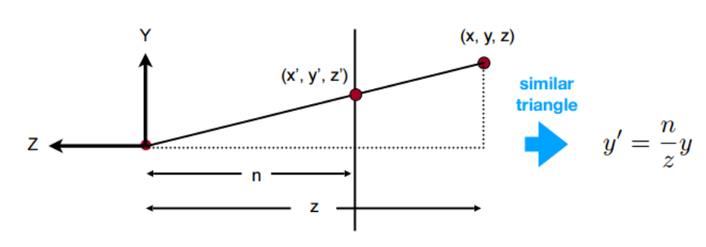
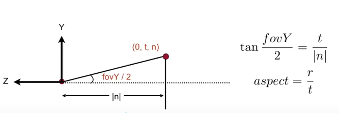

### **透视投影**

先转换为正交投影

 

这里假设`n`和`z`均为整数，代表距离，首先对于任意frustum内的点有：

$$
\left(\begin{array}{c}
x \\
y \\
z \\
1
\end{array}\right) \rightarrow\left(\begin{array}{c}
nx\\
ny\\
\text { unknown } \\
-z
\end{array}\right)
$$

可知：

$$
M_{persp->ortho}=
\left(\begin{array}{c}
n&0&0&0\\
0&n&0&0\\
?&?&?&?\\
0&0&-1&0
\end{array}\right)
$$

根据近平面内任意一点坐标不变有

$$
\left(\begin{array}{c}
n&0&0&0\\
0&n&0&0\\
0&0&A&B\\
0&0&-1&0
\end{array}\right)
\left(\begin{array}{c}
x\\
y\\
-n\\
1
\end{array}\right) \rightarrow
\left(\begin{array}{c}
nx\\
ny\\
-n^2\\
n
\end{array}\right)
$$

根据远平面内中心点坐标不变有

$$
\left(\begin{array}{c}
n&0&0&0\\
0&n&0&0\\
0&0&A&B\\
0&0&-1&0
\end{array}\right)
\left(\begin{array}{c}
0\\
0\\
-f\\
1
\end{array}\right) \rightarrow
\left(\begin{array}{c}
0\\
0\\
-f^2\\
f
\end{array}\right)
$$

因此有

$$
\left\lbrace
\begin{array}{c}
-nA+B=-n^2\\
-fA+B=-f^2
\end{array}
\right.
\rightarrow
\left\lbrace
\begin{array}{l}
A=n+f\\
B=nf
\end{array}
\right.
$$

所以将透视投影转换为正交投影的矩阵$M_{persp->ortho}$可写作：

$$
M_{persp->ortho}=
\left(\begin{array}{c}
n&0&0&0\\
0&n&0&0\\
0&0&n+f&nf\\
0&0&-1&0
\end{array}\right)
$$

接下来进行正交投影 

$$
M_{ortho}=
\left(\begin{array}{c}
\frac{2}{r-l}&0&0&0\\
0&\frac{2}{t-b}&0&0\\
0&0&\frac{2}{f-n}&0\\
0&0&0&1\\
\end{array}\right)
\left(\begin{array}{c}
1&0&0&-\frac{r+l}{2}\\
0&1&0&-\frac{t+b}{2}\\
0&0&1&-\frac{n+f}{2}\\
0&0&0&1\\
\end{array}\right)
$$

定义视角为`fovY`，宽高比`aspect =right/top`，`r=-l`、`t=-b`可根据`aspect`、`fovY`、`n`和`f`的值得到`l、n、b、t`的具体值

 

最终投影矩阵为

$$
M=
\left(\begin{array}{c}
\frac{n}{r}&0&0&0\\
0&\frac{n}{t}&0&0\\
0&0&\frac{f+n}{f-n}&\frac{2nf}{f-n}\\
0&0&-1&0
\end{array}\right)
$$
